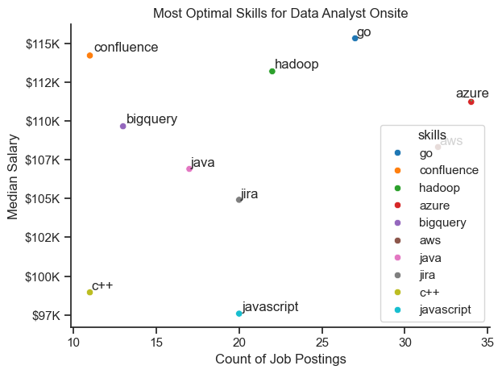
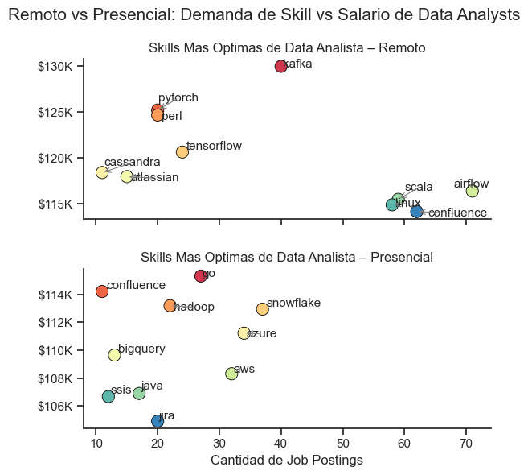

En los top 50 puestos mejor pagos de Data Analyst, SQL aparece como la skill más frecuente,
lo que confirma que sigue siendo un requisito estructural incluso en roles de alto salario.
Python ocupa el segundo lugar, reforzando su rol como herramienta clave para análisis avanzado
y automatización. Herramientas de BI como Tableau y Power BI siguen siendo relevantes,
pero con menor presencia, lo que sugiere que en los salarios más altos se priorizan
habilidades técnicas y de manipulación de datos por sobre herramientas puramente visuales.

## Top Skills in High-Paying Data Analyst Roles

**Insight**  
En los puestos remotos de Data Analyst, SQL es claramente la skill más demandada,
con una diferencia significativa respecto al resto. Esto refuerza que, incluso en
roles remotos, la capacidad de consultar y transformar datos sigue siendo el núcleo
del trabajo. Excel y Python aparecen en un segundo escalón, indicando que el perfil
más buscado combina bases sólidas en SQL con habilidades de análisis y manipulación
de datos. Las herramientas de BI (Tableau y Power BI) tienen presencia, pero no son
el factor principal en la demanda para roles remotos.

**Insight**  
Skills mejor pagas en roles de Data & AI
- Los salarios más altos se concentran en skills que permiten escalar, automatizar y mantener sistemas en producción, no en herramientas aisladas o “de moda”.
- Las tecnologías mejor pagas aparecen cuando forman parte del core del stack: pipelines de datos, infraestructura, MLOps y sistemas distribuidos.
- El valor salarial no depende tanto del lenguaje en sí, sino de dónde se usa dentro del sistema (orquestación, procesamiento, despliegue, confiabilidad).

Trabajo remoto
En los roles remotos, los mejores salarios están asociados a skills portables y estandarizadas, que permiten impacto sin depender del contexto interno de la empresa:
- Procesamiento y análisis de datos a gran escala: PySpark, Databricks, Pandas, NumPy, Airflow
- Flujos de trabajo colaborativos y reproducibles: GitLab, Bitbucket, Jupyter
- Fundamentos de data engineering y cloud: GCP, PostgreSQL, Elasticsearch
Los puestos remotos premian la autonomía técnica y la capacidad de diseñar y mantener soluciones end-to-end con mínima supervisión.

Trabajo presencial (onsite)
En los roles presenciales, los salarios más altos están ligados a skills fuertemente integradas a la infraestructura interna y a sistemas críticos de la organización:
- Infraestructura y automatización: Terraform, Ansible, Puppet, VMware
- Machine Learning avanzado y frameworks productivos: TensorFlow, PyTorch, Keras, Hugging Face
- Sistemas empresariales y bases de datos especializadas: Cassandra, MongoDB, Aurora, SVN
El trabajo onsite tiende a valorar más la especialización profunda, la cercanía con equipos de infraestructura y la gestión de entornos complejos y legacy.

## generar insights
optimal skills presencial

optimal skills remoto

comparacion de las dos
