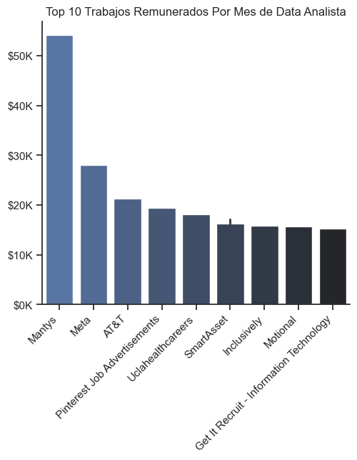
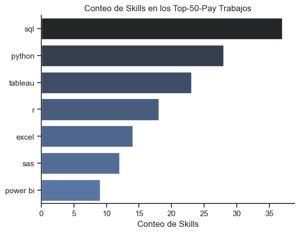
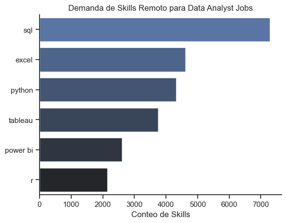
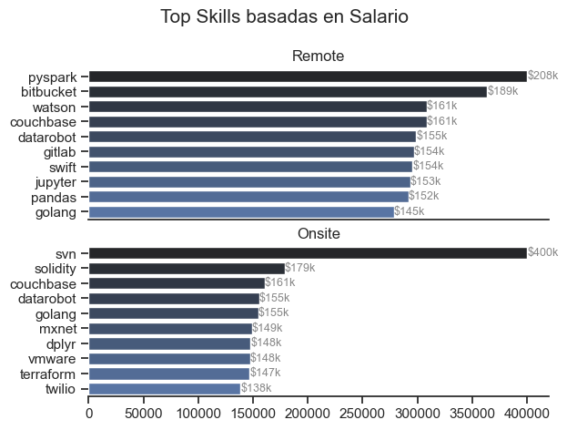

# Descripcion General del Proyecto
Este proyecto tiene como objetivo analizar una base de datos de gran volumen sobre ofertas laborales en el mercado tecnológico, con un enfoque específico en puestos de Data Analyst, tanto en modalidad remota como presencial.

El análisis se centra en identificar qué trabajos y skills ofrecen los salarios más altos, cuáles son las tecnologías más demandadas y qué combinaciones de salario y demanda hacen que una skill sea óptima para el mercado actual. El objetivo final es extraer insights accionables que ayuden a orientar decisiones de carrera y formación dentro del rol de Data Analyst.

## Metodología y Herramientas

El proyecto se desarrolló en dos etapas principales:

### 1. SQL Analisis (PostgreSQL)
Se realizaron 5 queries principales en SQL, conectadas a una base de datos en PostgreSQL, cada una diseñada para responder una pregunta clave del mercado laboral:
- ¿Cuáles son los trabajos mejor pagos?
- ¿Cuáles son las skills mejor pagas?
- ¿Cuál es la demanda de skills en puestos de Data Analyst?
- ¿Qué skills están asociadas a los salarios más altos?
- ¿Cuáles son las skills más óptimas combinando salario y demanda?

Estas consultas incluyeron el uso de:
- Joins entre múltiples tablas
- Funciones de agregación
- CTEs
- Filtros por modalidad (remote vs onsite)
- Análisis salarial y de demanda

### 2. Python Analisis y Visualizacion
A partir de las tablas generadas en SQL, se realizó un análisis exploratorio y visual en Python, utilizando principalmente:
- Pandas para manipulación y análisis de datos
- Matplotlib y Seaborn para visualización
- Gráficos comparativos entre modalidad remota y presencial
- Scatter plots para identificar skills óptimas según salario y demanda
Los gráficos permiten visualizar de forma clara:
- Comparaciones entre trabajo remoto y presencial
- Skills con mejor relación salario–demanda
- Tecnologías clave dentro del ecosistema de Data Analytics

## 1. Top 10 Trabajos Remunerados de Data Analista
En el siguiente grafico realizado con Pandas y Seaborn, visualizamos la primer query realizada en el proyecto,
que responde a la primer pregunta. 
Cuáles son las empresas en las que remunaran más a los Data Analistas? 
Que salario tienen?

### Codigo del Query
``` SQL
WITH ranked_jobs AS (
    SELECT 
        job_title,
        ROUND(salary_year_avg / 12, 2) AS salary_month,
        job_posted_date::DATE AS job_posted_date,
        cd.name AS company_name,
        ROW_NUMBER() OVER (
            PARTITION BY job_title_short
            ORDER BY salary_year_avg DESC
        ) AS salary_rank
    FROM job_postings_fact  jpf
    LEFT JOIN company_dim  cd ON cd.company_id = jpf.company_id
    WHERE
        job_title_short = 'Data Analyst'
        AND salary_year_avg IS NOT NULL
        AND job_location = 'Anywhere'
)
SELECT *
FROM ranked_jobs
WHERE salary_rank <= 10
ORDER BY salary_month DESC;
```
### Visualizacion del Query


*El grafico bar muestra en orden por salario y las 5 empresas que tienen los mejores salarios.*

## 2. Top Skills Mejores Pagas (Trabajos Remotos)
En esta consulta se analizaron los 50 trabajos remotos mejor pagos para el rol de Data Analyst con el objetivo de identificar qué skills aparecen con mayor frecuencia en las posiciones de mayor salario.
El conteo refleja cuántas veces cada skill es mencionada dentro de estos puestos top, permitiendo entender qué competencias son más valoradas en el segmento salarial alto.
### Codigo del Query
``` SQL
WITH top_paying_jobs AS (
    SELECT 
        job_id,
        job_title,
        ROUND(salary_year_avg / 12, 2) AS salary_month,
        name AS company_name
    FROM job_postings_fact
    LEFT JOIN company_dim ON company_dim.company_id = job_postings_fact.company_id
    WHERE
        job_title_short = 'Data Analyst' AND 
        salary_year_avg IS NOT NULL AND
        job_location = 'Anywhere'
    ORDER BY salary_year_avg DESC
    LIMIT 50
) 
SELECT 
    top_paying_jobs.*,
    sd.skills
FROM top_paying_jobs 
INNER JOIN skills_job_dim AS sjd ON sjd.job_id = top_paying_jobs.job_id
INNER JOIN skills_dim AS sd ON sd.skill_id = sjd.skill_id
ORDER BY top_paying_jobs.salary_month DESC;
```
### Visualizacion del Query

 

*El grafico muestra la cantidad de veces que aparecen las Skills dentro de los mejores 50 trabajos.*
### Insights:
- SQL domina claramente el top de trabajos mejor pagos, apareciendo con mucha más frecuencia que cualquier otra skill, lo que confirma que sigue siendo el pilar técnico principal incluso en roles de alto salario.

- Python y Tableau ocupan el segundo y tercer lugar, mostrando que la combinación de análisis programático + visualización es altamente demandada en los puestos mejor remunerados.

- Skills tradicionales como Excel, R y SAS siguen presentes, pero con menor peso relativo, lo que sugiere que no son diferenciadores fuertes frente a herramientas más modernas en el segmento top-paying.

## 3. Top Skills Demandadas en Trabajos de Data Analista (Remoto)
En esta consulta se muestran las skills mas demandadas para los trabajos remotos. Con el objetivo de identificar qué skills se requieren para poder posicionarse dentro del mercado laboral.
El conteo refleja cuántas veces cada skill es mencionada dentro todos los puestos de trabajo, permitiendo entender cuales son las más requeridas en el segmento laboral.
### Codigo del Query
``` SQL
SELECT 
    skills AS skill_name,
    COUNT(skills_job.job_id) AS demand_count
FROM job_postings_fact AS job_post
INNER JOIN skills_job_dim AS skills_job ON skills_job.job_id = job_post.job_id
INNER JOIN skills_dim ON skills_dim.skill_id = skills_job.skill_id
WHERE 
    job_post.job_title_short = 'Data Analyst' AND job_post.job_work_from_home = True
GROUP BY skill_name
ORDER BY demand_count DESC
LIMIT 6;
```
### Visualizacion del Query


*El grafico muestra la cantidad de veces que aparecen las Skills en los trabajos Remotos de Data Analista.*

### Insights:
- SQL sigue dominando claramente en el top de skills, en este caso como la que mas se demanda dentro del mercado laboral, apareciendo con mucha más frecuencia que cualquier otra skill, lo que confirma que sigue siendo el pilar técnico principal incluso en trabajos remoto.

- Excel y Python ocupan el segundo y tercer lugar, mostrando que la combinación de análisis de datos y visualizacion de los mismos es altamente demandada en los puestos remotos.

- Por ultimo tecnologias de visualizacion como Tableu y Power BI son las mas demandadas del mercado, y el lenguade de programacion R con menor peso relativo, lo que sugiere que sigue en uso pero en menor medida.


## 4. Skills basadas en Salarios Altos (Remote vs Onsite) 
En esta consulta se analizaron las skills asociadas a los salarios promedio más altos para el rol de Data Analyst, separando los resultados por modalidad de trabajo remota y presencial (onsite).
El objetivo fue identificar qué tecnologías están vinculadas a los niveles salariales más elevados en cada modalidad y comparar si el mercado remunera distinto según el contexto de trabajo.
### Codigo del Query
``` SQL
-- Trabajos Onsite
SELECT 
    ROUND(AVG(salary_year_avg),0) AS salary_avg,
    skills_dim.skills AS skill_name
FROM job_postings_fact as jpf
LEFT JOIN skills_job_dim ON skills_job_dim.job_id = jpf.job_id
LEFT JOIN skills_dim ON skills_dim.skill_id = skills_job_dim.skill_id
WHERE 
    jpf.job_title_short = 'Data Analyst' AND
    jpf.salary_year_avg IS NOT NULL
GROUP BY skills_dim.skills
ORDER BY salary_avg DESC
LIMIT 30;

-- Trabajos Remotos
SELECT 
    ROUND(AVG(salary_year_avg),0) AS salary_avg,
    skills_dim.skills AS skill_name
FROM job_postings_fact as jpf
LEFT JOIN skills_job_dim ON skills_job_dim.job_id = jpf.job_id
LEFT JOIN skills_dim ON skills_dim.skill_id = skills_job_dim.skill_id
WHERE 
    jpf.job_title_short = 'Data Analyst' AND
    jpf.salary_year_avg IS NOT NULL AND
    jpf.job_work_from_home = True
GROUP BY skills_dim.skills
ORDER BY salary_avg DESC
LIMIT 30;
```
### Visualizacion del Query


*El grafico muestra el salario promedio mas alto asociado a su skill recurrente entre Presencial vs Remoto.*

### Insights:
- En trabajos remotos, los salarios más altos están asociados a skills de data engineering, big data y ecosistemas cloud, destacándose PySpark, Databricks-related tools, Pandas y Golang. Esto sugiere que el mercado remoto premia perfiles híbridos entre Data Analyst y Data Engineer.

- En trabajos onsite, aparece una mayor dispersión salarial y casos extremos como SVN, con un salario muy superior al resto, lo que indica roles altamente específicos, legacy o de nicho, más comunes en entornos corporativos tradicionales.

- Skills compartidas como Couchbase, DataRobot, Golang y Twilio aparecen en ambos modos, pero con mejor remuneración promedio en modalidad remota, reforzando la idea de que el trabajo remoto amplifica el valor de skills técnicas avanzadas en el mercado global.

## 5. Optimal Skills – Remoto vs Presencial
Este gráfico compara las skills más óptimas para Data Analysts según la relación entre demanda laboral (cantidad de job postings) y salario promedio, diferenciando entre trabajo remoto y presencial. El objetivo es identificar qué tecnologías ofrecen el mejor equilibrio entre alta remuneración y oportunidades reales en cada modalidad.
### Codigo del Query
```SQL
-- Skills para trabajos Remotos
SELECT 
    skills_dim.skill_id,
    skills_dim.skills,
    COUNT(skills_job_dim.job_id) AS demand_count,
    ROUND(AVG(job_postings_fact.salary_year_avg),0) AS salary_avg
FROM job_postings_fact
INNER JOIN skills_job_dim ON skills_job_dim.job_id = job_postings_fact.job_id
INNER JOIN skills_dim ON skills_dim.skill_id = skills_job_dim.skill_id 
WHERE 
    job_postings_fact.job_title_short = 'Data Analyst' 
    AND job_postings_fact.job_work_from_home = True 
    AND job_postings_fact.salary_year_avg IS NOT NULL 
GROUP BY skills_dim.skill_id
HAVING COUNT(skills_job_dim.job_id) > 10
ORDER BY    
    salary_avg DESC,
    demand_count DESC
LIMIT 25;
-- Skills para trabajos Presencial
SELECT 
    skills_dim.skill_id,
    skills_dim.skills,
    COUNT(skills_job_dim.job_id) AS demand_count,
    ROUND(AVG(job_postings_fact.salary_year_avg),0) AS salary_avg
FROM job_postings_fact
INNER JOIN skills_job_dim ON skills_job_dim.job_id = job_postings_fact.job_id
INNER JOIN skills_dim ON skills_dim.skill_id = skills_job_dim.skill_id 
WHERE 
    job_postings_fact.job_title_short = 'Data Analyst' 
    AND job_postings_fact.salary_year_avg IS NOT NULL 
GROUP BY skills_dim.skill_id
HAVING COUNT(skills_job_dim.job_id) > 10
ORDER BY    
    salary_avg DESC,
    demand_count DESC
LIMIT 25;
```
### Visualizacion del Query


*El grafico muestra las skills mas demandadas con mejores salarios. Comparacion Presencial vs Remoto.*
### Insights:
- Remoto: menos demanda, salarios más altos en skills especializadas
Tecnologías como Kafka, PyTorch y TensorFlow muestran salarios elevados con una demanda moderada, lo que indica un mercado remoto más orientado a perfiles especializados y de nicho.
- Presencial: mayor estabilidad en skills enterprise
Skills como Hadoop, Snowflake, Azure y AWS combinan una demanda constante con salarios competitivos, reflejando una preferencia por tecnologías consolidadas en entornos corporativos.
- Demanda ≠ mejor salario: en ambos modelos, algunas skills con alta demanda (ej. Linux, Confluence) no lideran en salario, lo que refuerza que la especialización estratégica pesa más que la popularidad pura.

# Que Aprendizaje Obtuve
Durante este proyecto reforcé el uso de SQL para análisis exploratorio y analítico, aplicando agregaciones, joins, subqueries y funciones de agrupación para responder preguntas reales del mercado laboral. Además, aprendí a traducir datos en visualizaciones claras y a interpretar métricas como demanda, salario promedio y trade-offs entre especialización y empleabilidad.

# Insights Generales
Los resultados muestran que el trabajo remoto tiende a premiar skills más especializadas con salarios más altos, aunque con menor volumen de demanda, mientras que el modelo presencial prioriza tecnologías consolidadas y estables. La demanda por una skill no siempre implica un mejor salario, lo que resalta la importancia de elegir tecnologías estratégicas según el objetivo profesional.

# Desafíos que Enfrente
Uno de los principales desafíos fue definir métricas comparables entre modalidades remoto y presencial, evitando sesgos por volumen de datos. También fue clave limpiar y agrupar correctamente las skills, y encontrar la mejor forma de visualizar la relación entre salario y demanda sin perder claridad.

# Conclusion
Este proyecto demuestra cómo SQL puede utilizarse para generar insights accionables sobre el mercado laboral en Data Analytics. A partir de los datos, es posible identificar skills óptimas según contexto y modalidad de trabajo, ofreciendo una base sólida para la toma de decisiones tanto para profesionales como para empresas.